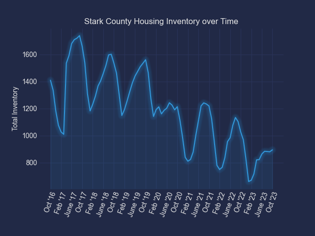
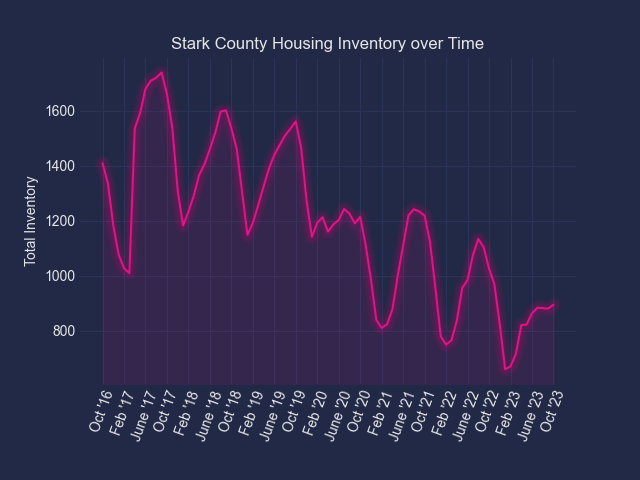
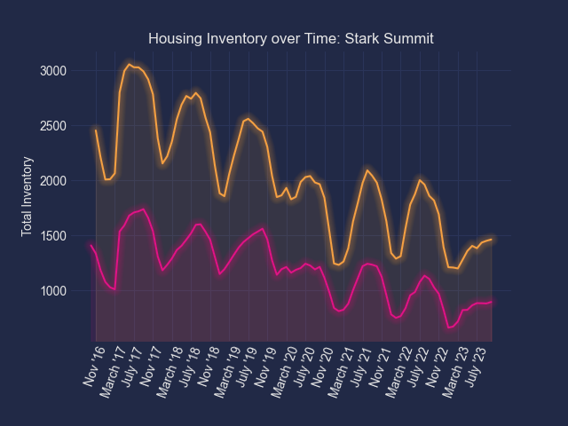

# housing-inventory-tracker

Creates a line graph showing inventory in a United States county using FIPs codes.

## How to Generate the Graph

1. Set your environment variables.

You need a couple environment variables

| Key                                                 | Description                                                               | Example                                       |
| --------------------------------------------------- | ------------------------------------------------------------------------- | --------------------------------------------- |
| raw_historical_county_inventory_data_save_location  | The file location and name where you want to save the downloaded raw data | "./data/raw-data.csv"                         |
| formatted_historical_county_inventory_data_location | The file location and name where you want to save the formatted data      | "./data/formatted-data.json"                  |
| inventory-tracker-graph-save-location               | The file location where you want to save the generated graphs             | "C:\Users\someUser\Desktop\generated-graphs\" |

_Notice that the inventory-tracker-graph-save-location env variable is JUST THE LOCATION. I'll probably change the other two to match that, but haven't done it yet._

2. Open a terminal in the project root directory.
3. Run `pip install -r requirements.txt`. This will install the required dependencies.
4. Run `python driver.py` with the appropriate CLI arguments (see below) which will download the raw data, format the raw data, and generate the graph image from the formatted data.

## CLI Arguments

There are some required and some optional CLI arguments

| flag       | description                                                                | example                  | required | default | additional notes                                                                      |
| ---------- | -------------------------------------------------------------------------- | ------------------------ | -------- | ------- | ------------------------------------------------------------------------------------- |
| --counties | The fips codes for all the counties you want to generate a line graph for. | --counties 39151 39153   | yes      |
| --colors   | The hex color codes you want to use for the lines on the graph.            | --colors #e01485 #f5a142 | no       |         | You need to provide the same number of colors as the number of counties you provided. |

## CLI Examples

Here's a few examples for you to further understand the CLI

`python driver.py --counties 39151 --colors #e01485`

`python driver.py --counties 39151 39153 --colors #e01485 #f5a142`

